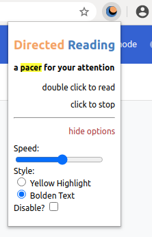
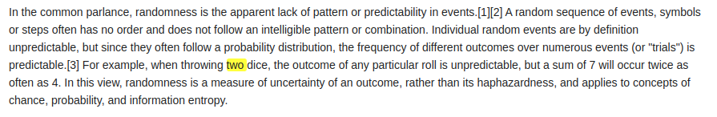
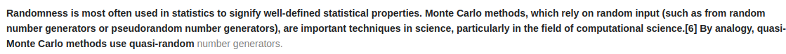

#  Directed Reading Chrome Extension 

See [booklet](https://github.com/beefan/booklet/) for origins of this project...

### Attention, the new oil?

Your attention is a central resource of the digital era. And it's unavoidably fragmented through information overload. 
This extension acts as a pacer for your attention as you read through journals, articles, emails, and blog posts!

Let **Directed Reading** guide you to faster, less fragmented digestion of digital information. 

examples:

#### runs well on
Sites I've tested where this extension seems to run well: 
* wikipedia.org
* npr.org
* medium.com

It should work for any site with lots of text.

Please let me know if you encounter any bugs or sites where it doesn't work. I would be happy to push updates. 